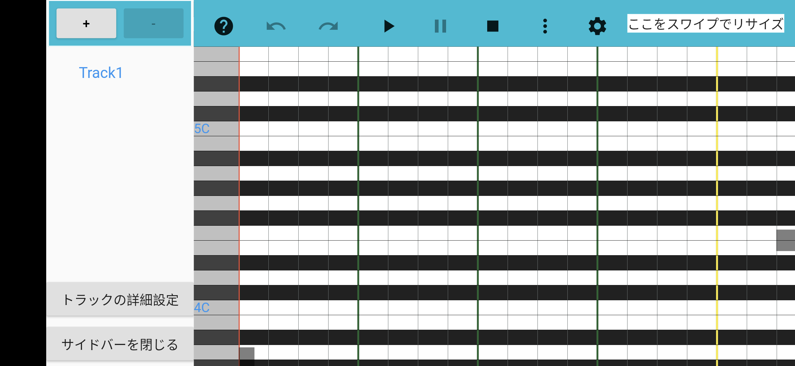
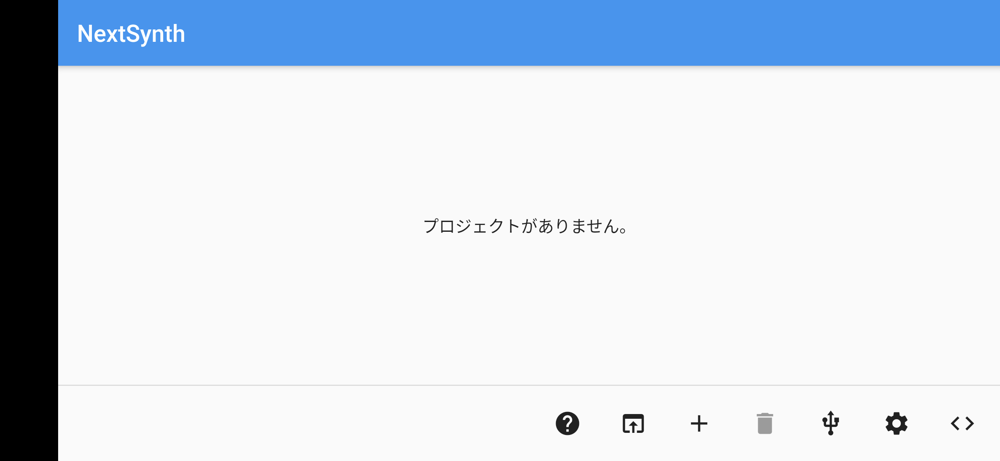
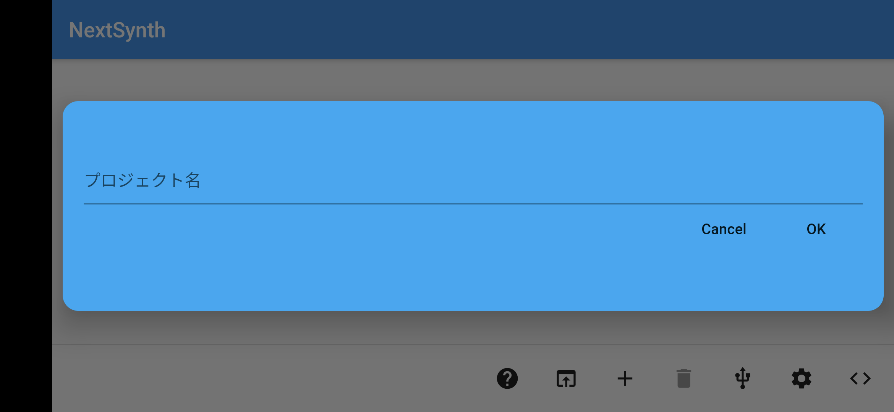
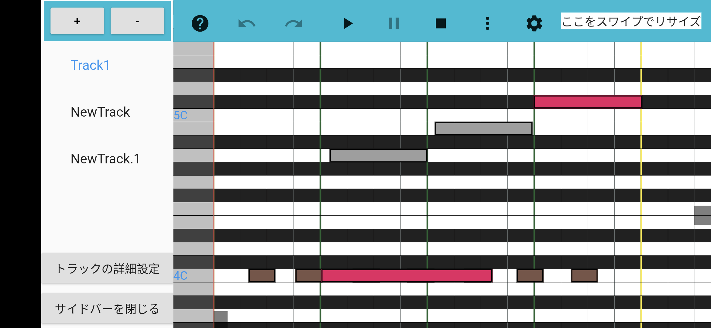
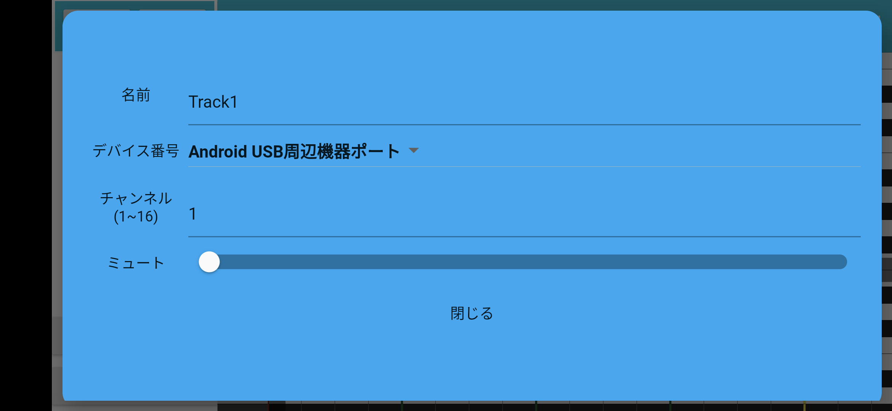

# 概要
NextSynthはUSB経由で接続されたMIDI機器にMIDIメッセージを送信できます。  
本アプリ本体はDAWソフトのようなピアノロール画面を備えており、指定されたノートをMIDIメッセージとして送信できます。

# 使い方
ノートを打ち込むためには、プロジェクトを作成する必要があります。  
プロジェクトはNextSynthの開始画面で作成/削除することができます。

名前をつけてプロジェクトを作成します。

プロジェクトは以下のようにタイル形式で表示されます。  
このタイルをダブルタップすることで編集画面へ遷移します。

編集画面です。  
ダブルタップでノートを作成することができ、ノートをタップすると選択状態になります。  
選択状態になったノートはまとめてドラッグ、リサイズが可能です。

ノートを作成した様子です。  
ノートが存在する状態で再生ボタンを押すと、接続中のMIDI機器にMIDIメッセージが送信されます。

複数のトラックを編集している場合は、他のトラックを別の色で表示します。

MIDIメッセージを送信するためには、事前にMIDI機器を接続状態にしておく必要があります。

また、トラックごとに送信対象のMIDI機器を選択可能です。

# ソースコード
NextSynthのソースコードは以下に置かれています。  
[NextSynth](https://github.com/desktopgame/next_synth)